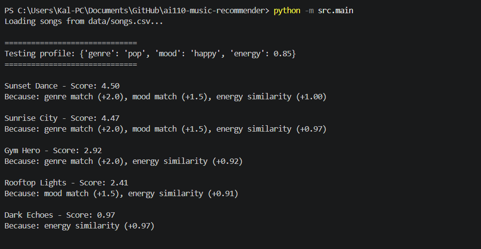
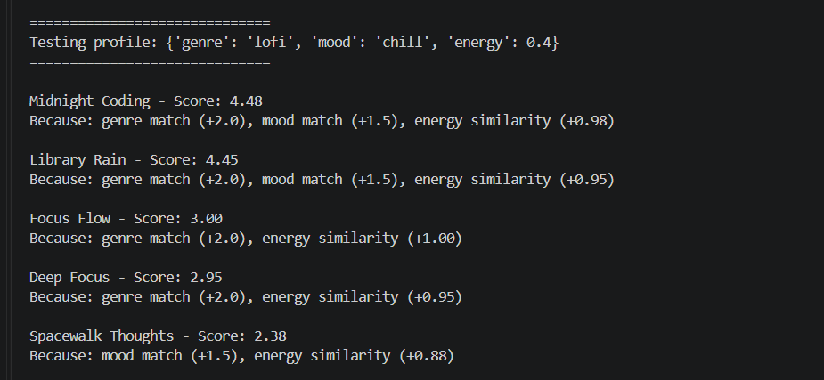
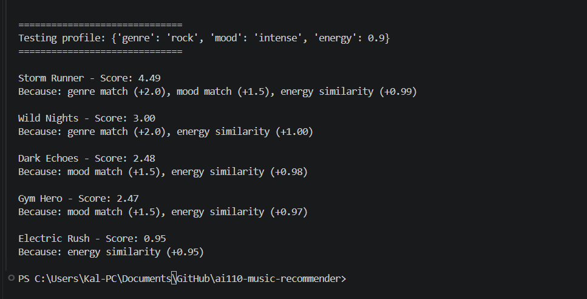

# 🎵 Music Recommender Simulation

## Project Summary

In this project you will build and explain a small music recommender system.

Your goal is to:

- Represent songs and a user "taste profile" as data
- Design a scoring rule that turns that data into recommendations
- Evaluate what your system gets right and wrong
- Reflect on how this mirrors real world AI recommenders

This project builds a simple music recommender system using a content-based filtering approach. The system compares song features such as genre, mood, and energy to a user's preferences and calculates a score for each song. Based on these scores, it ranks songs and returns the top recommendations. This project demonstrates how data can be transformed into personalized suggestions using basic algorithms.
---

## How The System Works

This recommender system suggests songs based on how well they match a user’s preferences using a content-based filtering approach. Instead of using other users’ data, the system compares features of each song directly to the user’s taste profile.

Each Song in the system includes features such as genre, mood, energy, tempo, and valence. These features help describe the overall style and “vibe” of the song.

The UserProfile stores the user’s preferred genre, mood, and target values for numerical features like energy and valence.

The recommender calculates a score for each song by awarding points for matching features. Songs receive higher scores if their genre and mood match the user’s preferences. Additional points are added based on how close the song’s energy and valence are to the user’s target values.

After scoring all songs, the system ranks them from highest to lowest score and returns the top results as recommendations.

### Algorithm Recipe

- +2.0 points for a genre match  
- +1.5 points for a mood match  
- Energy similarity score based on how close the song’s energy is to the user’s target:

  energy score = 1 − |song energy − user energy|

---

### Potential Bias

This system may over-prioritize genre since it has the highest weight. As a result, songs that match mood or energy but belong to a different genre may be ranked lower. Additionally, the limited dataset can reduce diversity and lead to repetitive recommendations.

Features Used

Song features:
              genre
              mood
              energy
              tempo_bpm
              valence
UserProfile features:
              preferred_genre
              preferred_mood
              target_energy
              target_valence

---

## Getting Started

### Setup

1. Create a virtual environment (optional but recommended):

   ```bash
   python -m venv .venv
   source .venv/bin/activate      # Mac or Linux
   .venv\Scripts\activate         # Windows

2. Install dependencies

```bash
pip install -r requirements.txt
```

3. Run the app:

```bash
python -m src.main
```

### Running Tests

Run the starter tests with:

```bash
pytest
```

You can add more tests in `tests/test_recommender.py`.

---

## Experiments You Tried


- When I reduced the weight of genre from 2.0 to 1.0, the recommendations became more diverse but less accurate.
- When I increased the importance of energy similarity, the system favored songs with similar intensity but sometimes ignored mood.
- Testing different user profiles (e.g., energetic pop vs chill lofi) showed that the system correctly adjusted recommendations based on preferences.

---

## Limitations and Risks

- The system relies on a small dataset, which limits the variety of recommendations.
- It does not consider lyrics, artist popularity, or listening history.
- It may over-prioritize genre due to its higher weight, reducing diversity.
- It assumes all users have simple and consistent preferences.

---

## Reflection

Read and complete `model_card.md`:

[**Model Card**](model_card.md)

Through this project, I learned how recommender systems transform user preferences and data into personalized suggestions. I was surprised by how a simple scoring system could produce results that feel meaningful and accurate. At the same time, I saw how biases can easily appear, such as over-prioritizing genre or ignoring other important aspects like diversity.

This project also showed me that even simple algorithms can feel intelligent, but they still lack deeper understanding compared to human judgment. In real-world systems, combining multiple data sources and improving fairness would be important for better recommendations.


---

## 7. `model_card_template.md`

Combines reflection and model card framing from the Module 3 guidance. :contentReference[oaicite:2]{index=2}  

```markdown
# 🎧 Model Card - Music Recommender Simulation

## 1. Model Name

Give your recommender a name, for example:

> VibeFinder 1.0

---

## 2. Intended Use

- What is this system trying to do
- Who is it for

Example:

> This model suggests 3 to 5 songs from a small catalog based on a user's preferred genre, mood, and energy level. It is for classroom exploration only, not for real users.

---

## 3. How It Works (Short Explanation)

Describe your scoring logic in plain language.

- What features of each song does it consider
- What information about the user does it use
- How does it turn those into a number

Try to avoid code in this section, treat it like an explanation to a non programmer.

---

## 4. Data

Describe your dataset.

- How many songs are in `data/songs.csv`
- Did you add or remove any songs
- What kinds of genres or moods are represented
- Whose taste does this data mostly reflect

---

## 5. Strengths

Where does your recommender work well

You can think about:
- Situations where the top results "felt right"
- Particular user profiles it served well
- Simplicity or transparency benefits

---

## 6. Limitations and Bias

Where does your recommender struggle

Some prompts:
- Does it ignore some genres or moods
- Does it treat all users as if they have the same taste shape
- Is it biased toward high energy or one genre by default
- How could this be unfair if used in a real product

---

## 7. Evaluation

The recommender system was tested using three different user profiles: high-energy pop, chill lofi, and intense rock.

For the high-energy pop profile, the system correctly returned songs like "Sunset Dance" and "Sunrise City," which match both genre and mood while also having high energy levels. Songs that matched only one feature ranked lower, showing that the scoring system works as intended.

For the chill lofi profile, the recommendations strongly matched expectations. Songs such as "Midnight Coding" and "Library Rain" ranked highest because they matched genre, mood, and energy. This demonstrates that the system effectively captures a relaxed musical vibe.

For the intense rock profile, "Storm Runner" ranked highest due to matching all key features. Other songs that matched only energy or mood appeared lower in the ranking, confirming that the system correctly balances multiple features.

Overall, the results show that the recommender produces accurate and consistent suggestions, though the strong weighting of genre can sometimes limit diversity.

## Evaluation Screenshots

### High-Energy Pop Profile


### Chill Lofi Profile


### Intense Rock Profile

---

## 8. Future Work

If you had more time, how would you improve this recommender

Examples:

- Add support for multiple users and "group vibe" recommendations
- Balance diversity of songs instead of always picking the closest match
- Use more features, like tempo ranges or lyric themes

---

## 9. Personal Reflection

A few sentences about what you learned:

- What surprised you about how your system behaved
- How did building this change how you think about real music recommenders
- Where do you think human judgment still matters, even if the model seems "smart"

